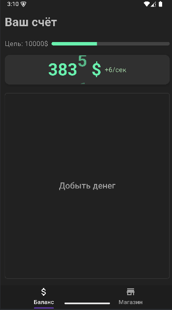
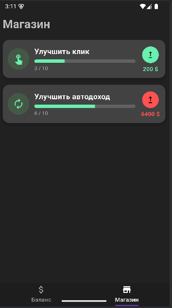

# Flutter Clicker Game

🎮 **Описание**  
Мини-игра «Кликер» на Flutter. Игрок нажимает на кнопку, чтобы зарабатывать деньги, может прокачивать апгрейды и автоматический доход. Цель игры — достигнуть установленного финансового порога.

---

## Особенности

- **Баланс** — показывает текущее количество денег.  
- **Апгрейды** — увеличение дохода за клик и автоматический доход.  
- **Прогресс** — прогресс-бар до цели.  
- **Сохранение** — текущее состояние игры сохраняется через `SharedPreferences`.  
- **UI** — тёмная тема, кастомные виджеты, анимации для прогресс-бара.  

---

## 🖼 Скриншоты

  
  

---

## ⚡ Запуск проекта

1. Клонируйте репозиторий:  
```bash
   git clone <your-repo-url>
```
2. Установите зависимости:

```bash
   flutter pub get
```
3. Запустите проект:

```bash
   flutter run
```

---

## 🛠 Технологии

* Flutter & Dart
* Provider для управления состоянием
* SharedPreferences для сохранений

---

## Будущие улучшения

* Экран победы после достижения цели.
* Более сложные апгрейды и механики.
* Адаптивный дизайн под разные устройства.

---

## 💡 Примечания

Проект создан для **практики**

